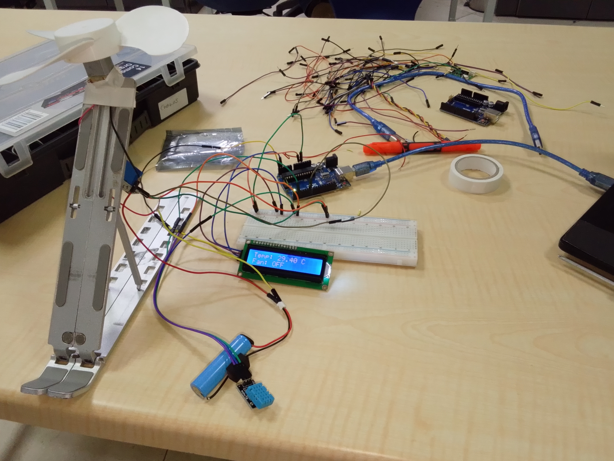

# Smart Temperature Controlled Fan Using Arduino

A smart automatic fan control system built using Arduino, DHT11 temperature sensor, relay module, and I2C LCD display.

The system reads temperature data from the DHT11 sensor and automatically controls a fan using a relay module. The current temperature and fan status are displayed on the LCD screen in real time.

---

## Features

- Real-time temperature monitoring
- Automatic fan ON/OFF control
- LCD temperature display
- DHT11 sensor integration
- Relay-based automation
- Beginner-friendly Arduino project

---

## Components Used

- Arduino Uno / Mega
- DHT11 Temperature Sensor
- 16x2 I2C LCD Display
- Relay Module
- DC Fan
- Jumper Wires
- Breadboard

---

## How It Works

- The DHT11 sensor measures the surrounding temperature.
- Arduino processes the temperature value.
- If temperature rises above 31°C:
  - Fan turns ON
- If temperature drops below 31°C:
  - Fan turns OFF
- LCD displays:
  - Current temperature
  - Fan status

---

## Circuit Connections

### DHT11
- VCC → 5V
- GND → GND
- DATA → Pin 2

### Relay Module
- IN → Pin 7
- VCC → 5V
- GND → GND

### I2C LCD
- SDA → SDA
- SCL → SCL
- VCC → 5V
- GND → GND

---

## Project Images

[Click Here for other images of the project](images)

## Arduino Libraries Used

- LiquidCrystal_I2C
- DHT Sensor Library

## Arduino Code

[Click Here For the Code](code/Adaptive_Fan_Controller_project_on_13th_May_2026.ino)

## Project Demostration video

[Click Here to check out the Video](https://youtu.be/018j-yUusR0)

